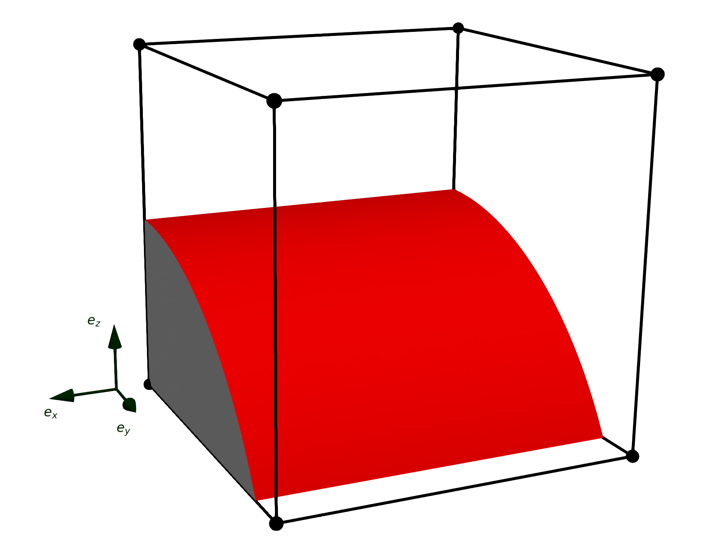
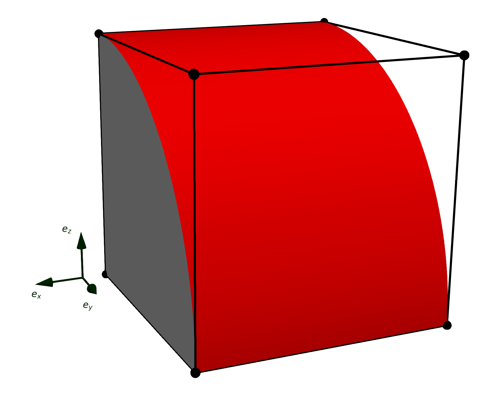
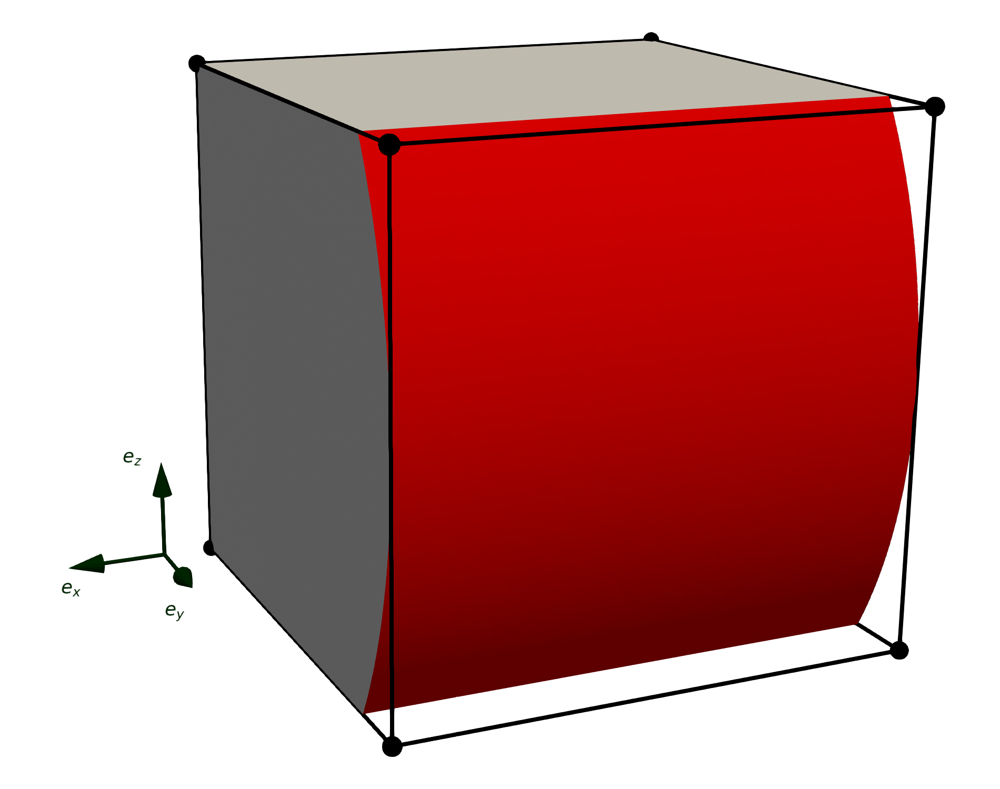
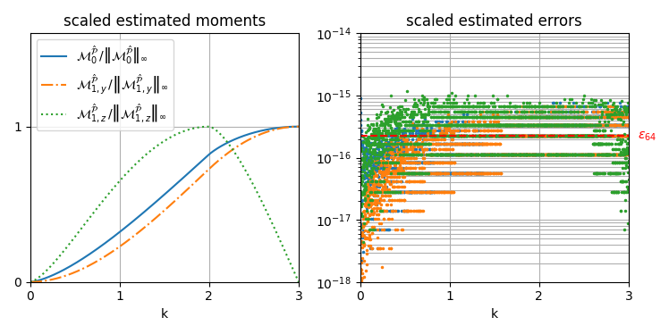
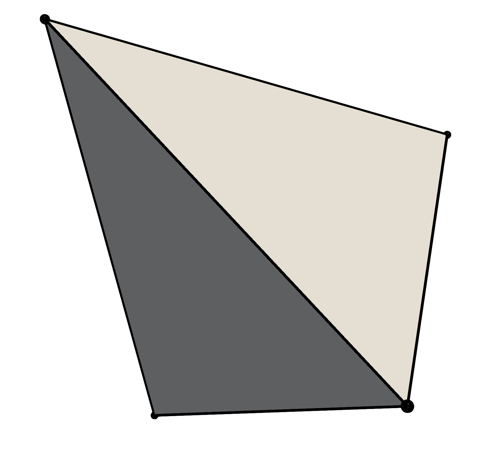
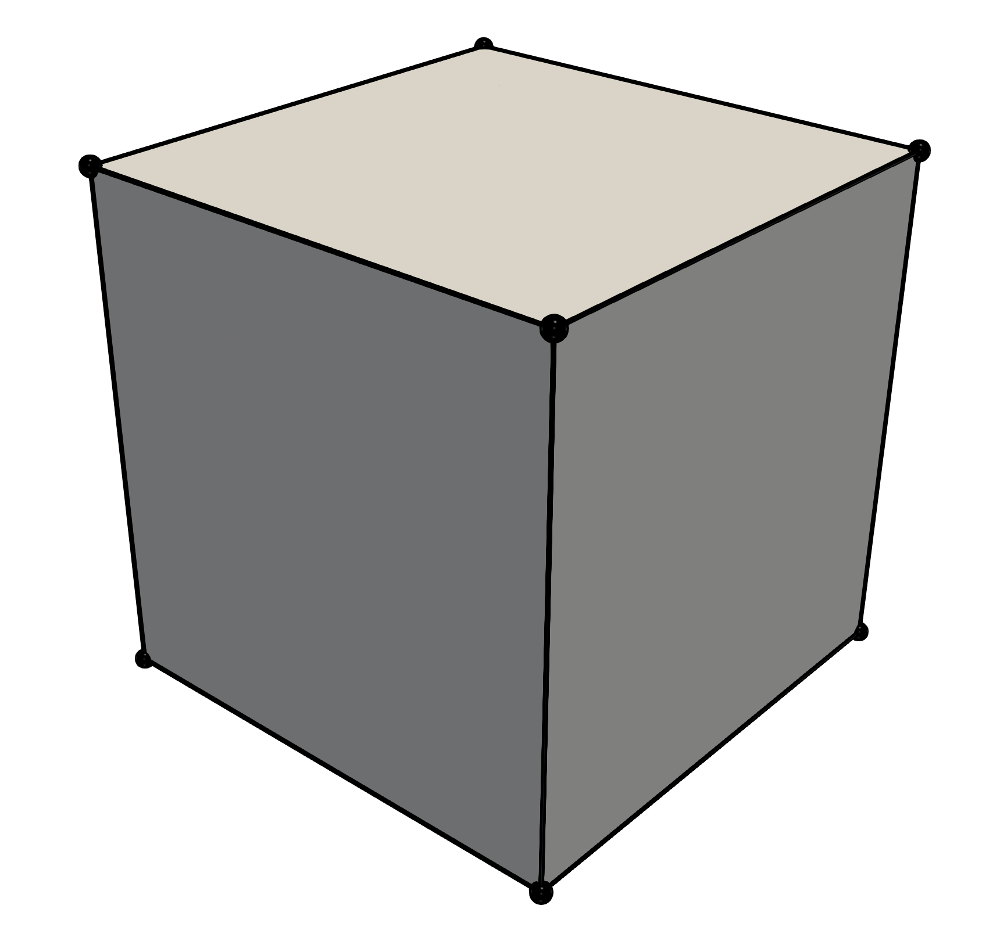
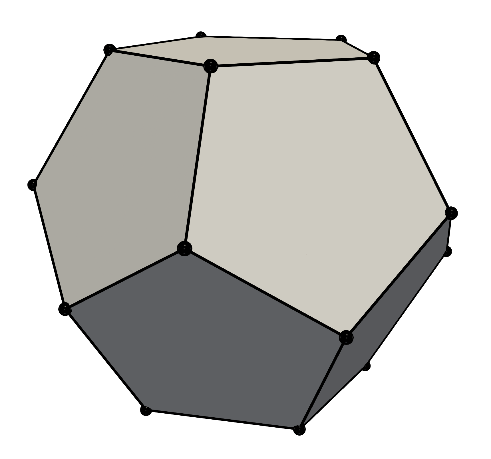
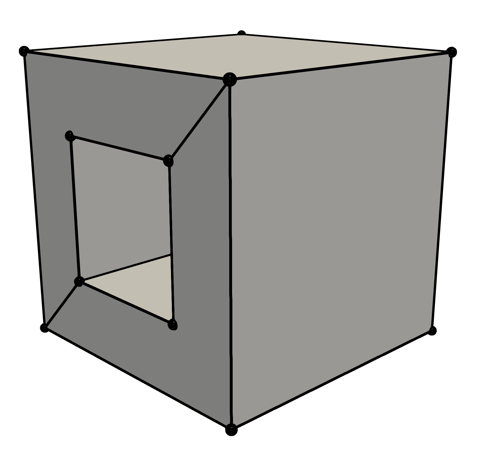

# Reproducing published results on cylinder-polytope intersection

This document explains how to reproduce the results presented in our journal paper on cylinder-polytope intersection, ~~published in the SIAM Journal on Scientific Computing [[link](https://en.wikipedia.org/wiki/HTTP_404)]~~ not yep published. 

~~A preprint of this article is available in [arXiv](https://en.wikipedia.org/wiki/HTTP_404) as well as in the [current repository](manuscript_paraboloid_intersection.pdf)~~.

## Unit cube translation (Section 4.1)

In order to reproduce Figures 1 and 2 of the [paper](), it is necessary to build the unit tests of IRL (for which the option `-D BUILD_TESTING=ON` must be provided when configuring IRL via CMake). This requires executing the additional command:

```bash
make irl_test
```

Once the unit tests have been built, the paraboloid-polyhedron intersections shown in Figure 1 of the [paper]() can be generated by executing:

```bash
./tests/bin/irl_test --gtest_filter=CylinderIntersection.SISCPaperFig1
```

This will generate a set of STL files which can be viewed with most visualization softwares (e.g., [Paraview](https://www.paraview.org/)). The files used to generate Figure 1 of the [paper]() are:

```
surface_[1-3].stl
unclipped_cube_[1-3].stl
```
resulting in the following visualizations:
||||
|:---:|:---:|:---:|
|Fig. 1a|Fig. 1b|Fig. 1c|

The exact moments and estimation errors plotted in Figure 2 of the [paper]() can be generated by executing:
```bash
./tests/bin/irl_test --gtest_filter=CylinderIntersection.SISCPaperFig2
```

This produces a text file named `fig_cylinder.csv` containing the data (i.e., the *scaled* moments and associated estimation errors) used for generating the plots in Figure 2, shown here:

||
|:---:|
|Fig. 2: Exact moments and error estimation|

## Parameter sweep study (Section 4.2-4.4)

The moment estimation errors and execution times resulting from the graded and random parameter sweeps of Section 4.2 to 4.4, presented in Tables 2, 3, 4, and 6, have been generated using our [*cylinder* testing suite](https://github.com/zerustu/IRL-cylinder-test).

This project can be cloned and built using:
```bash
git clone https://github.com/zerustu/IRL-cylinder-test.git
mkdir build
cd build
cmake -D IRL_ROOT_LOCATION=<path_to_IRL_project_directory> -D IRL_INSTALL_LOCATION=<path_to_IRL_install_directory> -D EIGEN_DIR=<path_to_eigen_directory> ..
make
```
This will generate 4 executables:
- `amr_generation`
- `cylinder_verification`
- `cylinder_timing`
- `test_configuration`

##

As the name indicates, `amr_generation` produces reference results for our parameter sweeps using AMR (adaptive mesh-refinement) of the clipped polyhedron's faces. 

`amr_generation` is used by running

```bash
./amr_generation --[shape] -l [max_amr_level] -n [number_of_cases] -o [output_file] [-e/-h/-b]
```

the description of each parameter and more can be display by doing
```bash
./amr_generation --help
```


The shapes available for testing are those introduced in Table 1 of the manuscript: 
| `tet` | `cube` | `dodecahedron` | `cube_hole` |
|:---:|:---:|:---:|:---:|
|||||

The input files used for producing the reference results used in Section 4.2 are given in the file specify after the `-o`. 

For instance,
``` bash
./amr_generation --tet -l 15 -n 1000 -o tet_result.csv -h
``` 
will generate the reference results of __1000__ random parameter sweep configuration for the tet, using a max amr level of __15__ and only generating hyperbolique case (-e is for elliptic, -h for hyperbolic and -b for both). These calculation are expensive, so we recommend to first test them for a limited number of cases, e.g., with `"number_of_tests": 1e2`.

the code will use openMP to parallelize the execution. you can change the number of thread by running :
```bash
export OMP_NUM_THREADS=[num]
```

##

Once reference results have been produced and stored, our algorithm for calculating the first moments of a polyhedron-paraboloid intersection can be tested using the executable `cylinder_verification`. For instance,

```bash
./cylinder_verification -f ./tet_result.csv --tet
``` 

will test IRL against the results of the random parameter sweep of the cube, and the result will be display in the standard output

`cylinder_verification` still need to be given the shape to use (and `--no_rescale` if using graded sweep was used)

##

`cylinder_timing` is used the same way as `cylinder_verification`, but made to measure the time of execution displayed in the table 6 of the [paper]()

##

Visulation like in figure 3 and 4 can be generated using `test_configuration`.

`test_configuration` can be use to run a single configuration of a polyhedron-cylinder intersection.

It can use the format generated by amr_generation or the user can specified each value. random configuration can also be generated.

more detail usage of all the program can be optain by running the program with the `--help` argument.